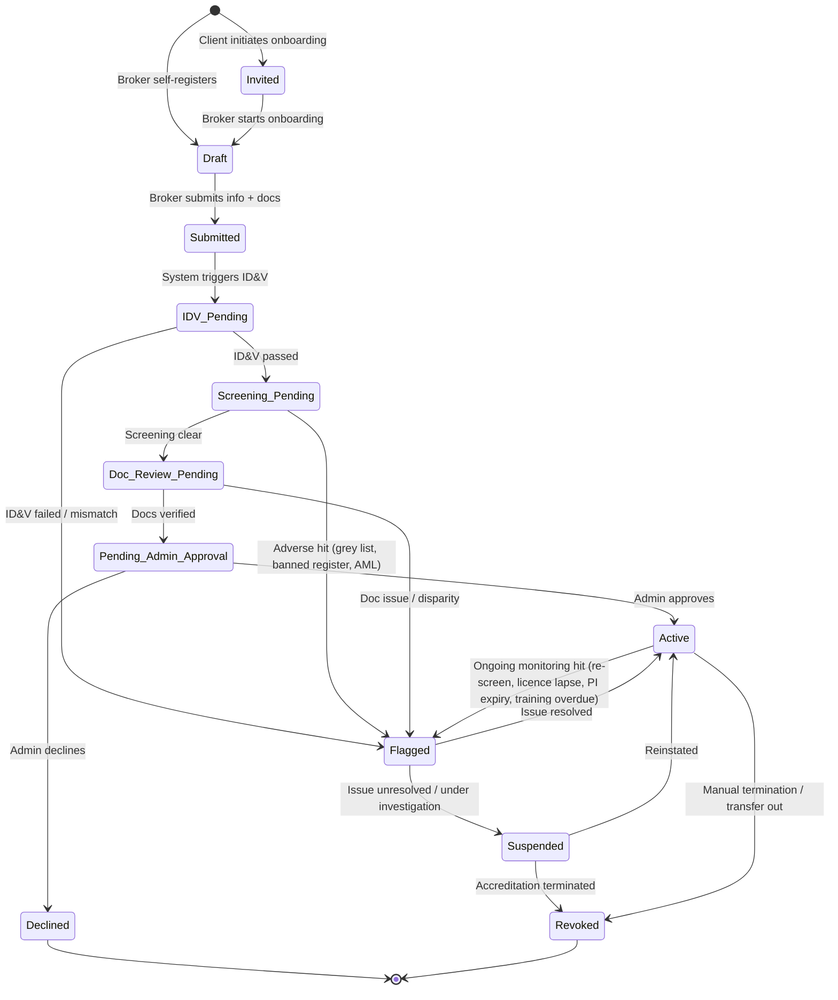

# Broker Identity & Verification Platform — Architecture & BRD Additions

**Status:** Working draft v0.2 — schema revised after a data-model review pass (broker/broker-business split, compliance notes & flags)
**Date:** 9 July 2026
**Purpose:** Extend the existing Business Requirements Document (v0.2) with a concrete domain model, the six empty epics, a recommended technical architecture, and a phased build plan. This is now the canonical living version of this document — it lives alongside the code in this repo rather than as a separate artifact.

**Working assumptions (confirmed):**
- Small team, 1–5 developers.
- Buy specialist regulated checks (IDV, AML, credit, police), build the orchestration/case management ourselves.
- AWS, ap-southeast-2 (Sydney) — Australian data residency.
- Greenfield platform; the original Thriski BRD is a reference requirements set, not a legacy codebase to migrate — see Section 6 for where we've deliberately gone beyond it.
- Training completion is a manual tick-box, marked by lender/aggregator staff — no LMS integration required.
- ASIC-related checks: FrankieOne is the target vendor long-term; ABN legitimacy is validated immediately via the free ABR ABN Lookup API (see Section 5).
- MFAA/FBAA membership verification stays manual (admin-confirmed; FBAA confirmed July 2026 they have nothing automated available). Once verified it's stored once at the broker level and reused across every organization the broker grants access to — a broker never re-declares it per relationship.
- Credit report: target a direct bureau API integration (Equifax/illion) rather than relying solely on broker-uploaded PDFs.
- Data sharing is broker-controlled: brokers auto-grant access to organizations they choose to work with, and organizations can request access to brokers they don't yet have a relationship with, subject to broker approval. See Section 1.1 and the Data sharing & consent epic (Section 3).
- Access grant revocation is never blocked, even while an organization holds a currently active relationship with the broker — the broker retains full control at all times (resolves Open decision #3 fully, see Section 8).
- Verification check currency is a single global policy, not configurable per organization: every check type expires 12 months after it runs (resolves Open decision #4, see Section 8).
- Broker businesses are modelled as their own entity, separate from individual brokers: some are sole traders (the broker effectively is the business), others are companies/partnerships/trusts with many individual brokers working under them. See Section 1 (updated) and the new Broker business & structure epic (Section 3).
- FBAA, MFAA, lenders and aggregators can log notes and raise formal compliance flags against a broker or broker business. Notes default private to the authoring organization; flags are always visible network-wide to anyone with granted access, since that's their purpose. See the new Compliance notes & flags epic (Section 3).
- Client organization onboarding (aggregators/lenders/associations getting their own platform account) is confirmed as a real future need but explicitly deferred for now.

---

## 1. Domain model

The core insight from the BRD: a broker is a single identity that holds *multiple, independent relationships* with aggregators/broking firms, lenders, and associations. Status, accreditation, and training are properties of the **relationship**, not just the broker. A broker can be Active with Lender A and Suspended with Lender B at the same time. Get this modelled correctly early — it's expensive to retrofit.

**A second, equally important split: individual vs. business.** A broker (a person) usually operates through a broking business, and that business is not always simple. Some are sole traders, where the individual effectively *is* the business. Others are companies, partnerships, or trusts with several individual brokers working under the one entity, one ACL (or one Credit Representative arrangement under an aggregator's ACL), and one set of business-level accreditations. Getting this wrong means either forcing every business into a "one broker = one entity" shape that breaks the moment a multi-broker firm signs up, or bolting business fields directly onto the individual (which is what the first pass of this schema did, and which doesn't survive a business with three brokers in it). So `Broker` (the individual) and `BrokerBusiness` (the entity) are separate models, connected by `BrokerBusinessMembership` — a join table that supports one broker belonging to one business (sole trader) or many (multi-broker firm), and preserves history when a broker moves between businesses rather than overwriting it.

```mermaid
erDiagram
    BROKER ||--o{ BROKER_RELATIONSHIP : "has"
    BROKER ||--o{ BROKER_BUSINESS_MEMBERSHIP : "belongs to"
    BROKER_BUSINESS ||--o{ BROKER_BUSINESS_MEMBERSHIP : "has members"
    BROKER_BUSINESS ||--o{ BROKER_BUSINESS_RELATIONSHIP : "has"
    ORGANIZATION ||--o{ BROKER_RELATIONSHIP : "party to"
    ORGANIZATION ||--o{ BROKER_BUSINESS_RELATIONSHIP : "party to"
    ORGANIZATION ||--o{ BROKER_BUSINESS : "is ACL holder for (if credit rep)"
    BROKER ||--o{ DOCUMENT : "may own"
    BROKER_BUSINESS ||--o{ DOCUMENT : "may own"
    BROKER ||--o{ VERIFICATION_CHECK : "may be subject of"
    BROKER_BUSINESS ||--o{ VERIFICATION_CHECK : "may be subject of"
    BROKER ||--o{ COMPLIANCE_NOTE : "may be subject of"
    BROKER_BUSINESS ||--o{ COMPLIANCE_NOTE : "may be subject of"
    BROKER ||--o{ COMPLIANCE_FLAG : "may be subject of"
    BROKER_BUSINESS ||--o{ COMPLIANCE_FLAG : "may be subject of"
    BROKER_RELATIONSHIP ||--o{ TRAINING_RECORD : "requires"
    BROKER_RELATIONSHIP ||--o{ STATUS_EVENT : "logs"
    BROKER_BUSINESS_RELATIONSHIP ||--o{ STATUS_EVENT : "logs"
    ORGANIZATION ||--o{ PORTAL_USER : "employs"
    PORTAL_USER ||--o{ STATUS_EVENT : "actions"
    PORTAL_USER ||--o{ COMPLIANCE_NOTE : "authors"
    PORTAL_USER ||--o{ COMPLIANCE_FLAG : "raises/resolves"
    VERIFICATION_CHECK ||--o{ DOCUMENT : "references"
    BROKER ||--o{ ACCESS_GRANT : "controls"
    ORGANIZATION ||--o{ ACCESS_GRANT : "requests/holds"

    BROKER {
        uuid id
        string first_name
        string last_name
        date date_of_birth
        string email
        string phone
        string personal_crn "individual's own CR number, if any"
        string overall_status
    }
    BROKER_BUSINESS {
        uuid id
        string legal_name
        string entity_type "sole_trader | company | partnership | trust"
        string abn_acn
        string acl_holder_type "own_acl | credit_representative"
        string acl_number
        string credit_representative_number
        uuid acl_holder_organization_id "nullable - whose ACL, if CR"
    }
    BROKER_BUSINESS_MEMBERSHIP {
        uuid id
        uuid broker_id
        uuid broker_business_id
        string role "principal | director | credit_representative | employee"
        boolean is_primary
        date start_date
        date end_date
    }
    ORGANIZATION {
        uuid id
        string org_type "aggregator | lender | association | internal"
        string legal_name
        string abn_acn
    }
    BROKER_RELATIONSHIP {
        uuid id
        uuid broker_id
        uuid organization_id
        uuid broker_business_id "nullable - business context at the time"
        string status
        date accredited_date
        date next_review_date
    }
    BROKER_BUSINESS_RELATIONSHIP {
        uuid id
        uuid broker_business_id
        uuid organization_id
        string status
        date accredited_date
        date next_review_date
    }
    VERIFICATION_CHECK {
        uuid id
        uuid broker_id "nullable - exactly one of broker_id/broker_business_id"
        uuid broker_business_id "nullable"
        string check_type "idv | aml | credit | police | asic | abn"
        string vendor
        string result
        jsonb raw_response
        timestamp run_at
        timestamp expires_at "global policy: run_at + 12 months"
    }
    DOCUMENT {
        uuid id
        uuid broker_id "nullable - exactly one of broker_id/broker_business_id"
        uuid broker_business_id "nullable"
        string doc_type
        string storage_key
        string review_status
    }
    TRAINING_RECORD {
        uuid id
        uuid relationship_id
        string training_name
        boolean completed
        date completed_date
        uuid marked_by_user_id
        date expiry_date
    }
    STATUS_EVENT {
        uuid id
        uuid relationship_id "nullable - exactly one of relationship_id/business_relationship_id"
        uuid business_relationship_id "nullable"
        string from_status
        string to_status
        uuid actioned_by
        text reason
        timestamp created_at
    }
    PORTAL_USER {
        uuid id
        uuid organization_id
        string role
        string first_name
        string last_name
        string email
        boolean is_active
    }
    ACCESS_GRANT {
        uuid id
        uuid broker_id
        uuid organization_id
        string origin "broker_initiated | org_requested"
        string status "pending | granted | denied | revoked"
        uuid requested_by_user_id
        uuid decided_by_broker_id
        timestamp requested_at
        timestamp decided_at
    }
    COMPLIANCE_NOTE {
        uuid id
        uuid broker_id "nullable - exactly one of broker_id/broker_business_id"
        uuid broker_business_id "nullable"
        uuid organization_id "author org"
        uuid author_user_id
        text body
        string visibility "private_to_org | network_visible"
        timestamp created_at
    }
    COMPLIANCE_FLAG {
        uuid id
        uuid broker_id "nullable - exactly one of broker_id/broker_business_id"
        uuid broker_business_id "nullable"
        uuid raised_by_organization_id
        uuid raised_by_user_id
        string category "conduct | fraud | documentation | licence | complaint | other"
        string severity "low | medium | high | critical"
        string status "open | under_review | resolved | dismissed"
        text description
        timestamp created_at
    }
```

Note `overall_status` on `BROKER` is a derived rollup for display purposes (e.g. "Active" if any relationship is active); the source of truth is always at the `BROKER_RELATIONSHIP` level. `STATUS_EVENT` is your audit trail — every status change, automated or human, gets a row here. This table is what a compliance auditor or a lender's risk team will eventually ask to see, so treat it as append-only from day one.

**On the nullable "exactly one of X / Y" fields** (`VERIFICATION_CHECK`, `DOCUMENT`, `STATUS_EVENT`, `COMPLIANCE_NOTE`, `COMPLIANCE_FLAG`): these can each be about an individual broker or a broker business — a police certificate is individual, a PI insurance certificate or an ASIC company check is business-level, a compliance flag could be either. The schema comment in `packages/db/prisma/schema.prisma` documents this convention; it's enforced in application code for now, and should get a database-level CHECK constraint in a follow-up migration once the pattern has proven out.

**`BROKER_RELATIONSHIP` vs. `BROKER_BUSINESS_RELATIONSHIP`:** the BRD's onboarding flow is broker-centric (an individual selects an aggregator/lender/association), so `BROKER_RELATIONSHIP` stays the primary accreditation record and matches the BRD's user stories directly. `BROKER_BUSINESS_RELATIONSHIP` exists alongside it for the business-level agreement (the actual aggregation agreement is between the business and the aggregator, not the individual) — a sole trader will typically have a mirrored pair of rows (one business relationship, one broker relationship), while a multi-broker firm has one business relationship and several broker relationships, one per individual who's active there. `BROKER_RELATIONSHIP.broker_business_id` is optional and records which business the individual was operating under at the time, mainly for compliance history as brokers move between firms.

### 1.1 Core product thesis: verify once, trusted by the whole network

This is the actual differentiator, so it's worth making explicit rather than leaving implicit in the data model. There's a real-world precedent for this pattern: the US mortgage industry's NMLS (Nationwide Multistate Licensing System) centrally maintains each loan originator's licence, history, and standing, and every state regulator and lender checks the same record instead of running their own separate process. That's the shape of what you're describing for the AU broker market.

The mechanism this implies:

- **`VERIFICATION_CHECK` is deliberately modelled at the `BROKER` level, not the `BROKER_RELATIONSHIP` level** (see the ERD above). ID&V, AML/screening, police check, credit check, and ABN/ASIC checks are run once per broker and are the single shared source of truth — they are not re-run per aggregator or lender.
- **`BROKER_RELATIONSHIP` stays org-scoped** because accreditation is still each organization's own risk decision — a lender can look at the same verified facts and still decide not to accredit a broker. Verification is shared; the accreditation decision is not.
- **Sharing is broker-controlled via `ACCESS_GRANT`, not automatic.** There are two ways an organization gets access to a broker's verification bundle: (1) **broker-initiated** — the broker selects that aggregator/lender/association during onboarding or adds them as a new relationship later, which counts as consent and auto-grants access; (2) **org-requested** — an organization (e.g. an aggregator doing due diligence before recruiting a broker, or a lender checking a broker before accepting referred business) can request access to a broker who hasn't connected with them yet. That request sits as `pending` until the broker explicitly approves or denies it in their profile. Nothing is visible to an organization until one of these two paths results in a `granted` status.
- **Brokers can revoke access.** A granted `ACCESS_GRANT` can be revoked by the broker at any time for an organization they no longer have an active relationship with, which removes that org's visibility going forward. (Revoking access for an organization with a *currently active* accreditation relationship needs a product decision — likely blocked or requires first ending the relationship, since an org can't sensibly hold an active accreditation for a broker it can no longer see the compliance status of.)
- **When access is granted, the new organization gets read access to the broker's already-completed, still-current verification bundle immediately** — no re-submission, no re-running ID&V or a police check that was done three months ago for a different lender. This is the literal mechanism behind "complete it once, use it everywhere," it's just gated by broker consent rather than automatic network-wide visibility.
- **Adverse findings broadcast to everyone currently granted access, not just logged.** If a scheduled re-check turns up a hit — a name appears on a banned/disqualified register, PI insurance lapses, a licence is suspended — every organization holding a `granted` `ACCESS_GRANT` for that broker should be notified, not just the one whose check triggered it. A broker flagged with one lender is a broker every other lender relying on them needs to know about, immediately. This is also the mechanism that gives the broker real protection: nobody sees anything without a grant, but once granted, safety-relevant information can't be selectively hidden from one party while shown to another.
- **Currency/expiry policy may need to be configurable per check type** (e.g. some organizations may want a police certificate refreshed every 12 months, others every 6) rather than one global expiry rule — flagged as an open decision in Section 8 rather than solved here.

This also directly addresses a pain point visible in your own source material: the "Transfer Requests" process document shows that today, when a broker moves between aggregators, someone manually creates a folder, checks old ID numbers, reconfirms licence status, and re-issues a new broker ID — days of manual admin for information that was already verified. A shared verification record makes broker mobility close to instant instead of a re-onboarding event.

---

## 2. Broker relationship status state machine

This state machine lives at the `BROKER_RELATIONSHIP` level and runs independently per aggregator/lender/association. "Ongoing monitoring" (BRD: *Broker Profile* epic, "see when my next ongoing monitoring date is") is what moves an `Active` relationship to `Flagged` — a scheduled job re-runs screening checks and checks document/training expiry on a cadence (e.g. monthly for screening, on-expiry for PI insurance and police certificates).

---

## 3. Empty epics — filled in

### Epic: Broker business & structure

*(New — not in the original BRD, which only modelled individual brokers. Captures the sole-trader vs. multi-broker-firm distinction from Section 1.)*

| Requirement | MVP | MoSCoW | Data required |
|---|---|---|---|
| As a broker, I want to register my broking business as part of onboarding, indicating whether it's a sole trader, company, partnership, or trust | Yes | | BROKER_BUSINESS: legal_name, trading_name, entity_type, abn_acn, website |
| As a broker, I want to indicate whether my business holds its own ACL or operates as a Credit Representative under another organization's ACL | Yes | | acl_holder_type, acl_number OR credit_representative_number, acl_holder_organization_id |
| As a broker who is a sole trader, the system should treat me as my own business without requiring extra steps | Yes | | Single BROKER_BUSINESS_MEMBERSHIP row, is_primary=true |
| As a principal of a multi-broker firm, I want to add other brokers as members of my business | Yes | | BROKER_BUSINESS_MEMBERSHIP: broker_id, broker_business_id, role |
| As a broker, I want my membership history preserved when I move to a different business, not overwritten | Yes | | end_date on the old membership row, new row on the new business |
| As a Client staff member, I want to see which business (and which other brokers) a given broker is currently associated with | Yes | | BROKER_BUSINESS_MEMBERSHIP query, scoped by AccessGrant |
| As an Admin, I want to see a broking business's full roster of current and past brokers | Yes | | BROKER_BUSINESS_MEMBERSHIP history for a given broker_business_id |

### Epic: Client access

| Requirement | MVP | MoSCoW | Data required |
|---|---|---|---|
| As a Client (Aggregator/Lender/Association) staff member, I want to log in to a portal scoped to my organization so I only see brokers relevant to my org | Yes | | Portal user: name, email, role, organization_id |
| As a Client staff member, I want to see the list of brokers with an active or pending relationship to my organization | Yes | | Broker relationship status, broker summary fields |
| As a Client admin, I want to invite additional staff users from my organization into the portal | No | C | Invited email, role |
| As a Client staff member, my access should be limited to brokers with a relationship to my org — I should not see other organizations' brokers | Yes | | Row-level scoping by organization_id |
| As a Client (Lender/Aggregator) staff member, I want to mark training as complete for a broker in my org's relationship | Yes | | Training name, completed date, marked_by |
| As a Client staff member, I want to request additional documents or information from a broker | No | S | Message/request record |

### Epic: Data sharing & consent

*(New — not in the original BRD. Resolves the network-visibility consent question in Section 1.1: brokers control access; organizations can request it.)*

| Requirement | MVP | MoSCoW | Data required |
|---|---|---|---|
| As a broker, selecting an aggregator/lender/association during onboarding or adding a new relationship automatically grants that organization access to my verification profile | Yes | | ACCESS_GRANT (origin=broker_initiated, status=granted) |
| As a Client staff member, I want to request access to a broker's verification profile even if we don't yet have a relationship (e.g. before recruiting or accepting referred business) | Yes | | ACCESS_GRANT (origin=org_requested, status=pending) |
| As a broker, I want to see pending access requests from organizations and approve or deny each one | Yes | | Broker-facing request queue |
| As a broker, I want to see the full list of organizations currently able to view my verification profile | Yes | | ACCESS_GRANT list, status=granted |
| As a broker, I want to revoke an organization's access when I no longer have a relationship with them | Yes | | ACCESS_GRANT status → revoked |
| As the system, I should prevent revoking access for an organization that holds a currently active accreditation relationship, or require ending the relationship first | No | S | Validation rule tying ACCESS_GRANT to BROKER_RELATIONSHIP status |
| As a Client staff member, I want to be notified when a broker grants, denies, or revokes my organization's access | Yes | | Notification trigger on ACCESS_GRANT status change |
| As the system, every grant/deny/revoke decision must be logged with who and when for audit purposes | Yes | | ACCESS_GRANT requested_at/decided_at/decided_by fields |

### Epic: Compliance notes & flags

*(New — not in the original BRD. FBAA, MFAA, lenders, and aggregators can keep notes and flag compliance issues on a broker or broker business.)*

| Requirement | MVP | MoSCoW | Data required |
|---|---|---|---|
| As a Client (FBAA/MFAA/lender/aggregator) staff member, I want to add a free-text note against a broker or broker business | Yes | | COMPLIANCE_NOTE: body, organization_id, author_user_id, visibility |
| As a Client staff member, my notes default to private to my organization unless I explicitly mark them shared | Yes | | visibility = private_to_org by default |
| As a Client staff member, I want to optionally mark a note as network-visible so other organizations with access can see it | Yes | | visibility = network_visible |
| As a Client (FBAA/MFAA/lender/aggregator) staff member, I want to raise a formal compliance flag against a broker or broker business with a category and severity | Yes | | COMPLIANCE_FLAG: category, severity, description |
| As the system, a raised flag must be visible to every organization holding a GRANTED AccessGrant for that broker/business, not just the organization that raised it | Yes | | Broadcast on flag creation, same mechanism as an adverse VerificationCheck result (Section 1.1) |
| As a Client staff member, I want to mark a flag I raised (or that's assigned to my organization) as resolved, with resolution notes | Yes | | status → resolved, resolved_at, resolved_by_user_id, resolution_notes |
| As an Admin, I want to see all open flags across every broker/business platform-wide for compliance oversight | Yes | | Cross-org query, internal/admin role only |
| As a broker, I want to see compliance flags raised against me or my business (not necessarily the private notes behind them) | No | S | Broker-facing flag view — whether brokers see flags at all, and how much detail, is a policy question worth a deliberate decision rather than a default |

### Epic: Client dashboard

| Requirement | MVP | MoSCoW | Data required |
|---|---|---|---|
| As a Client staff member, I want a dashboard summarizing counts of brokers by status (active, pending, flagged, suspended) for my org | Yes | | Aggregated relationship status counts |
| As a Client staff member, I want to see brokers requiring my action (pending review, requested info outstanding) | Yes | | Filtered relationship queue |
| As a Client staff member, I want to see upcoming re-accreditation / re-screening dates for my brokers | No | S | next_review_date per relationship |
| As a Client staff member, I want to export a broker list/report | No | C | CSV/PDF export |

### Epic: Broker statuses

| Requirement | MVP | MoSCoW | Data required |
|---|---|---|---|
| As an Admin or Client, I want to see a broker relationship's current status from a defined set of states (see state machine, Section 2) | Yes | | status enum, relationship_id |
| As an Admin or Client, I want every status change logged with who/when/why | Yes | | STATUS_EVENT record |
| As an Admin, I want to manually override a broker relationship's status with a documented reason | Yes | | reason (required free text) |
| As a broker, I want to see my own status per relationship in my profile | Yes | | relationship status list |
| As a system, I want to automatically transition a relationship to Flagged when a scheduled re-check returns an adverse result | No | S | Scheduler + check result |
| As an Admin, I want to see a global list of all Flagged/Suspended brokers across all clients for compliance oversight | Yes | | Cross-org query (internal/admin role only) |

### Epic: Verro 'admin' review

*(Internal ops/compliance team — the platform operator's own review workflow, distinct from Client review.)*

| Requirement | MVP | MoSCoW | Data required |
|---|---|---|---|
| As an internal Admin, I want a review queue of brokers pending document or ID&V review | Yes | | Queue filtered by status = Doc_Review_Pending / IDV_Pending |
| As an internal Admin, I want to view a broker's full submitted profile, documents, and verification check results in one place | Yes | | Aggregated broker view |
| As an internal Admin, I want to approve or decline each verification step with a reason | Yes | | Decision + reason, tied to STATUS_EVENT |
| As an internal Admin, I want to see disparities the system flags between broker-entered data and ID&V-extracted data before approving | Yes | | Diff view (BRD: Epic Identity verification) |
| As an internal Admin, I want to assign a review to a specific team member | No | S | assignee_id |
| As an internal Admin, I want an audit log of all my review decisions | Yes | | STATUS_EVENT, filterable by actioned_by |

### Epic: Broker onboarding by client

| Requirement | MVP | MoSCoW | Data required |
|---|---|---|---|
| As a Client (Aggregator/Lender) staff member, I want to invite a broker to onboard onto the platform via email | Yes | | Invite email, organization_id, invited_by |
| As an invited broker, I want to receive an email that starts my onboarding pre-linked to the inviting organization | Yes | | Invite token, pre-filled organization relationship |
| As a Client staff member, I want to see the status of broker invitations I've sent (sent, started, completed) | Yes | | Invite status |
| As a Client staff member, I want to bulk-invite multiple brokers via a spreadsheet upload | No | C | CSV of broker emails/names |

### Epic: Training

*(Confirmed: no LMS integration. Training completion is a manual attestation by lender/aggregator staff.)*

| Requirement | MVP | MoSCoW | Data required |
|---|---|---|---|
| As a Client (Lender/Aggregator) staff member, I want to mark a named training item as complete for a broker relationship | Yes | | Training name (free text or org-maintained dropdown), completed (bool), completed_date, marked_by |
| As a Client staff member, I want to optionally set an expiry/renewal date on a completed training item | No | S | expiry_date |
| As a broker, I want to see which training items are marked complete/outstanding per relationship in my profile | Yes | | Training list per relationship |
| As the system, when a training item is marked complete, I want to log who did it and when for audit purposes | Yes | | STATUS_EVENT-style log entry |
| As an internal Admin, I want to see training completion status across all brokers for compliance oversight | No | S | Cross-org training query |
| As the system, I want to notify a broker when a Client marks their training incomplete/outstanding past a due date | No | C | Notification trigger |

### Epic: Security

| Requirement | MVP | MoSCoW | Data required |
|---|---|---|---|
| All personal and sensitive documents (ID, police certificates, credit reports) must be encrypted at rest and in transit | Yes | | KMS-encrypted S3, TLS everywhere |
| Portal access must be role- and organization-scoped; no cross-tenant data leakage | Yes | | RBAC + row-level scoping |
| All authentication must support MFA | Yes | | MFA enrolment per user |
| All admin and reviewer actions must be logged immutably | Yes | | STATUS_EVENT / audit log |
| Document access should be via short-lived signed URLs, not direct storage links | Yes | | Presigned URL expiry |
| Sensitive fields (DOB, credit report contents) should be access-logged on read, not just write | No | S | Read audit log |

### Epic: Notifications

| Requirement | MVP | MoSCoW | Data required |
|---|---|---|---|
| As a broker, I want an email when my status changes (approved, flagged, suspended) | Yes | | Email trigger on STATUS_EVENT |
| As a Client staff member, I want an email when a broker I invited completes onboarding or needs my review | Yes | | Email trigger |
| As a broker, I want in-app notifications visible in my profile | No | S | Notification record, read/unread |
| As an internal Admin, I want a digest of items requiring review (daily/weekly) | No | S | Scheduled digest job |

---

## 4. Technical architecture

**Repo structure:** Single monorepo (Turborepo). Three portals as route groups within one Next.js app (`/broker`, `/portal`, `/admin`) sharing a component library and typed API client — simplest possible operational footprint for a small team, with role-based routing and layout switching rather than three separate deployments. Split into separate apps later only if deployment cadence or team structure demands it.

**Backend:** NestJS (TypeScript) as a modular monolith — modules mirror the domain: `Onboarding`, `VerificationOrchestration`, `CaseCompliance`, `Documents`, `Notifications`, `Admin`. TypeScript end-to-end (Next.js + NestJS) minimizes context-switching for a small team and lets you share types between frontend and backend directly.

**Database:** Postgres on RDS, ap-southeast-2, single region. Row-level security or scoped-query middleware enforcing organization-based tenancy for Client portal users.

**Storage:** S3 (ap-southeast-2), KMS encryption at rest, presigned URLs for upload/download, lifecycle policies for retention.

**Async / verification orchestration:** This is the one part of the system that genuinely needs a durable, resumable workflow — checks span days, involve external webhooks, and require human-in-the-loop gates. Start with BullMQ (Redis-backed job queue) driving the explicit state machine in Section 2, with every step and vendor response written to `VERIFICATION_CHECK` and `STATUS_EVENT`. Design the orchestration module behind a clean interface so it can be swapped for a managed workflow engine (Temporal Cloud) later without a rewrite, once check volume or workflow complexity grows.

**Auth:** AWS Cognito (in-region) for broker and internal admin login with MFA. Plan for SAML/SSO (e.g. via WorkOS, layered alongside Cognito) for financial-institution portal users — banks will eventually require it.

**Notifications:** Transactional email via SES or Postmark; in-app notifications as a simple table + read state; SMS (Twilio, AU numbers) reserved for time-sensitive compliance alerts if needed later.

---

## 5. Vendor / integration matrix

| Capability | Recommended AU option(s) | Status |
|---|---|---|
| Identity verification (document + biometric) | FrankieOne (orchestrator covering IDV + AML + device intel in one API); alternatives: OCR Labs, GreenID | Confirmed viable — evaluate FrankieOne first to reduce integration count |
| AML / PEP / sanctions screening | FrankieOne, or Dow Jones Risk & Compliance / Refinitiv World-Check directly | Confirmed viable |
| Credit / company / bankruptcy report | Equifax or illion, via direct API | **Target: Phase 1 API integration**, contingent on completing the bureau's commercial/credit-provider accreditation — start that conversation immediately, since bureau onboarding lead time can run longer than a dev sprint. Broker-uploaded PDF is the fallback if the bureau agreement isn't ready by launch |
| ABN / entity legitimacy | ABR ABN Lookup API (free, government-run) | **Confirmed, usable now.** Validates ABN is registered, current, and GST-registered — matches the manual ABN check step in the current Westpac process |
| ASIC licence status, banned & disqualified register | FrankieOne | **Target vendor** — confirm during vendor evaluation that FrankieOne's AU coverage extends to the banned/disqualified register and ACL/ACR status specifically, since ABN Lookup alone does not cover this. Manual/periodic checks are the fallback until integrated |
| Police check | fit2work, National Crime Check (NCC) | Confirmed viable — both already named in the original BRD |
| Association membership verification (MFAA/FBAA) | No known public API | **FBAA confirmed (July 2026): nothing available at the moment** — no data feed or API today. MFAA not yet contacted. Verification stays fully manual (admin-confirmed against the association), but once confirmed the membership record is verified once at the broker level and reused across every organization the broker grants access to — see Section 1.1 and the Data sharing & consent epic. MVP: broker self-declares + uploads membership certificate, admin verifies |
| Document OCR / data extraction | AWS Textract, or a specialist document-AI vendor for less-structured docs (resumes, PI certificates) | Confirmed viable — Phase 2 |
| Training tracking | None required — manual tick-box by Client staff | No vendor needed |

---

## 6. Additional platform opportunities

The BRD is a good starting point but it's essentially an onboarding-and-checklist spec. Given the network model in Section 1.1, the platform can do meaningfully more than the BRD asks for. Worth keeping these on the roadmap even if none are Phase 1:

- **Broker portability / instant transfer.** The Transfer Requests doc shows the real cost today: a broker moving aggregators triggers days of manual re-verification, folder creation, and ID re-issuance. With a shared verification record, a broker changing aggregators becomes "accept the new relationship," not "re-onboard from scratch." This is arguably the single highest-leverage feature for aggregator/lender adoption, since it's a direct, visible cost saving they feel immediately.
- **FI-facing API, not just a portal.** Aggregators and lenders already run their own loan origination systems (LOS) and CRMs. A read API ("is this broker currently accredited, in good standing, any open flags?") lets them check broker status programmatically at the point of loan submission, rather than a human checking a separate portal. This is what turns the platform from "another system to log into" into infrastructure that plugs into existing workflows — usually the difference between grudging adoption and real usage.
- **Network-wide compliance alerting.** Beyond broadcasting a flag to existing relationships (Section 1.1), consider a standing subscription model: an organization can watch for status changes on brokers they have a relationship with, even ones who haven't submitted a deal recently, so risk teams get proactive alerts rather than finding out at the next onboarding cycle.
- **Public or semi-public verification lookup.** A limited, non-sensitive "is broker X currently accredited and in good standing" lookup (name, ACL/CRN, current status only — no personal or document data) could let a consumer or a lender not yet on the platform verify a broker independently. This is optional and needs privacy/consent thought, but it's the kind of thing that builds trust in the platform as a category-defining utility rather than just another vendor tool.
- **Composite trust/risk indicator.** Rather than each organization interpreting a pile of raw check results themselves, a simple derived indicator (e.g. verified / verified-with-history / flagged) summarizing verification recency, compliance history, and any past adverse findings gives Client staff a fast read without requiring them to parse every check.
- **Complaint and determination tracking.** AFCA determinations against a broker are a natural future data source to feed into the shared compliance record — this is exactly the kind of adverse event that should be visible network-wide per the Section 1.1 model, even though the BRD doesn't mention it.
- **Adjacent verticals, later.** The same identity-verification-and-accreditation-registry pattern applies to other regulated Australian professions (insurance brokers, financial advisers) if the mortgage broker version proves out the model. Not a near-term build item, but worth knowing the architecture doesn't box you out of it — the domain model (Broker/Organization/Relationship/Check) is already generic enough.
- **Monetization angle worth noting for planning purposes (not an engineering decision):** a network utility like this typically monetizes on the organization side (aggregators/lenders/associations paying for API access, seats, or verified-broker volume) while staying free or low-cost for individual brokers, since broker adoption is what makes the network valuable to organizations in the first place.

---

## 7. Phased build plan

Cross-checked against the original BRD's MVP (Yes/No) and MoSCoW (C) flags — the phasing below lines up closely with your own original prioritization, which is a good consistency signal. A few items have moved earlier based on this conversation (ABN Lookup is free and simple; credit bureau API is now the explicit target rather than a "nice to have").

**Phase 1 — MVP**
Auth + three portal shells with RBAC/org-scoping · broker onboarding wizard (personal + business info, document upload, attestations, association link, aggregator link, lender multi-select, ACL entity info) · broker profile (info, onboarding progress, photo) · Client portal (broker list scoped to org, dashboard, manual training tick-box) · broker relationship status state machine (core states) · internal Admin review queue (approve/decline docs and ID&V) · single ID&V vendor integration (FrankieOne) · ABN Lookup API integration (entity legitimacy, free) · credit bureau API integration if the commercial accreditation with Equifax/illion closes in time, otherwise broker-uploaded PDF as fallback · email notifications on status change · shared verification visibility across relationships (Section 1.1 mechanism).

**Phase 2**
FrankieOne integration for ASIC licence/banned & disqualified screening plus AML/PEP · automated document OCR/extraction · ongoing monitoring scheduler (periodic re-checks, expiry tracking, network-wide flag broadcast) · broker onboarding initiated by Client (invite flow) · credit bureau API integration if not already live in Phase 1 · save-as-draft onboarding · address lookup · in-app notifications.

**Phase 3**
Police check integration · in-solution chat · SSO for enterprise Client organizations · advanced admin reporting/compliance dashboards · training expiry automation (if Clients want it) · bulk broker invite · FI-facing read API · composite trust/risk indicator.

---

## 8. Open decisions to resolve early

1. **FrankieOne ASIC coverage** — confirm during vendor evaluation that FrankieOne's AU product actually covers the ASIC banned & disqualified register and ACL/ACR status specifically (not just IDV/AML), since that's distinct from the ABN Lookup API.
2. **Credit bureau commercial accreditation** — start the Equifax/illion conversation now; commercial/credit-provider accreditation timelines can be long enough to affect the Phase 1 date.
3. ~~**Network visibility consent model**~~ — **Fully resolved.** Brokers control access via `ACCESS_GRANT` (Section 1.1, Data sharing & consent epic): broker-initiated relationships auto-grant, organization-initiated requests need explicit broker approval, and **revocation is never blocked, even while the organization holds a currently active relationship** — the broker retains full control at all times. Implemented as-is in `access-grants.service.ts` (no blocking check). One residual legal item: the ToS should be explicit that revoking access from an org with an active accreditation is allowed and leaves that org's accreditation active-but-blind, since that's a slightly unusual state worth spelling out rather than leaving implicit.
4. ~~**Check currency/expiry policy**~~ — **Resolved.** A single global policy, not configurable per organization: every check type expires 12 months after `run_at`, platform-wide. Implemented as `VerificationCheck.expiresAt` in the schema.
5. **Organization onboarding flow** — confirmed as a real need, explicitly deferred for now. Revisit once broker-side Phase 1 is solid.
6. **Broker visibility of flags raised against them** — whether a broker can see compliance flags raised on their own profile (and how much detail — category/severity only, or the full description) is a genuine policy question, not just a technical one. Worth deciding deliberately alongside the ToS/consent work rather than defaulting either way.
7. **DB-level enforcement of the "exactly one subject" rule** — `VerificationCheck`, `Document`, `StatusEvent`, `ComplianceNote`, and `ComplianceFlag` all rely on application code to ensure exactly one of their broker/business (or relationship/business-relationship) foreign keys is set. Worth adding a CHECK constraint via a raw SQL migration once the pattern has proven out in practice, rather than trusting application code indefinitely.

---

## 9. Where to begin

Two tracks run in parallel from day one. The vendor/legal track has lead times measured in weeks; don't let it gate the start of engineering, and don't let engineering ignore it until it's "needed."

**Parallel track — start this week, independent of engineering:**
- Contact FrankieOne: get sandbox access for IDV, and get a straight answer on whether their AU coverage includes the ASIC banned & disqualified register and ACL/ACR status (Open decision #1) — this determines whether Phase 2 needs a different vendor.
- Contact Equifax and/or illion about commercial/credit-provider accreditation for API access to credit and company reports. This is usually the longest lead time in the whole plan — start it now so it isn't the thing blocking Phase 1.
- ~~Contact FBAA~~ **Done — confirmed nothing available at the moment.** Still worth contacting MFAA for the same confirmation, and flagging the broker-controlled sharing model to both associations since they may want visibility into it.
- Draft a Privacy Policy / ToS that reflects the resolved consent model (Section 1.1 / Open decision #3): broker-initiated relationships auto-grant, org-requested access needs broker approval, brokers can revoke. Get this drafted before the onboarding and Client-request UI is built, not after.
- Stand up the AWS account, ap-southeast-2 as default region, and basic IAM/billing hygiene.

**Engineering track — build in this order, not by epic:**

*Milestone 0 — Foundations.* Monorepo scaffolding (Turborepo, Next.js shell with three route groups, NestJS backend skeleton), Postgres schema migration for the core entities in Section 1 (`BROKER`, `ORGANIZATION`, `BROKER_RELATIONSHIP`, `STATUS_EVENT`, `PORTAL_USER`, `ACCESS_GRANT`), Cognito auth with basic RBAC, S3 bucket with KMS, minimal CI/CD. Get this schema right before writing UI against it — it's the one thing genuinely expensive to change once real data exists. `ACCESS_GRANT` belongs in the schema from the start even though its UI comes later, since retrofitting a consent model onto existing broker-relationship data is painful.

**Status: this is now scaffolded in this repo.** See `README.md` for what's real vs. stubbed — the schema, module structure, and portal shells exist; Cognito, S3, and vendor integrations still need real credentials. The schema has since been revised once already (broker/broker-business split, compliance notes & flags, resolved Open decisions #3/#4) — expect the domain model to keep evolving in this pause-and-review way for another round or two before it settles; that's a normal and healthy part of Milestone 0, not scope creep.

*Milestone 1 — Manual walking skeleton.* Broker registration and the onboarding wizard (personal + business info, document upload, attestations, association/aggregator link, lender multi-select, ACL info — selecting an org here auto-creates a `granted` `ACCESS_GRANT`), broker profile view, internal Admin review queue with manual approve/decline, the status state machine (Section 2) driven entirely by human decisions, email notification on status change. No vendor integrations yet. This alone is a real, shippable product — it replaces the spreadsheet-and-shared-drive process visible in your own source docs, and it's worth pausing here to get real broker/aggregator feedback before automating anything.

*Milestone 2 — First automated check.* Integrate the ABN Lookup API — it's free, has no vendor negotiation, and proves out the verification orchestration pattern (job queue → `VERIFICATION_CHECK` record → status transition) on the simplest possible check before adding a more complex vendor.

*Milestone 3 — Identity verification.* Integrate FrankieOne for ID&V once sandbox access lands from the parallel track. This is where the "system compares broker-entered data against extracted ID&V data and flags disparities" requirement from the BRD gets built.

*Milestone 4 — Client portal goes live, network model activates.* Client (aggregator/lender/association) login scoped to their organization, broker list, org-requested access flow (org requests → broker approves/denies in their profile — the Data sharing & consent epic), and — critically — once granted, that relationship instantly sees the existing verification bundle for a broker who's already verified elsewhere. This is the actual MVP in a product sense: it's the point where the core thesis (verify once, trusted by all, with the broker in control of who sees it) is real and demonstrable to a design partner, not just a data model on paper.

*Milestone 5 — Ongoing monitoring and remaining checks.* Scheduled re-checks, network-wide flag broadcast on adverse findings, AML/screening and credit bureau integrations as those vendor relationships close, police check integration, document OCR.

Practically: aim to get one or two design-partner aggregators/lenders using Milestone 1 for real (even manually-checked) broker onboarding as early as possible. Their feedback on the workflow itself will be worth more than any amount of upfront spec work, and it de-risks the harder vendor integrations before you've built the whole thing around assumptions nobody's validated.
